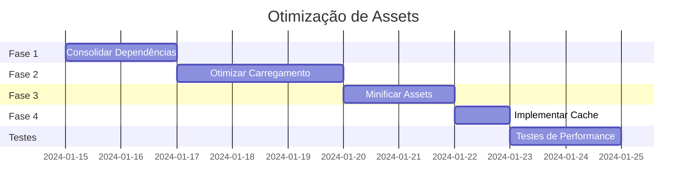

# 🚀 PLANO DE OTIMIZAÇÃO DE ATIVOS - PERFORMANCE

**Sistema:** Dragão Lanches - Sistema de Delivery  
**Foco:** Otimização de CSS, JavaScript e recursos estáticos  
**Criado em:** $(date)  
**Status:** Análise completa - Problemas críticos identificados

---

## 🔍 PROBLEMAS CRÍTICOS IDENTIFICADOS

### 1. **DUPLICAÇÃO MASSIVA DE BOOTSTRAP**

**Severidade:** 🔴 CRÍTICA

**Problema:**

- Bootstrap carregado **3 vezes** na mesma página:

  ```html
  <!-- Versão local -->
  <link rel="stylesheet" href="assets/css/bootstrap.min.css" />

  <!-- CDN v5.2.0-beta1 -->
  <link
    href="https://cdn.jsdelivr.net/npm/bootstrap@5.2.0-beta1/dist/css/bootstrap.min.css"
  />

  <!-- Painel Admin - v5.0.0 -->
  <link href="../assets/plugins/bootstrap/css/bootstrap.min.css" />
  ```

**Impacto:**

- **+350KB** de CSS desnecessário
- Conflitos de estilos entre versões
- Tempo de carregamento 3x maior

---

### 2. **JQUERY DUPLICADO E VERSÕES CONFLITANTES**

**Severidade:** 🔴 CRÍTICA

**Problema:**

- jQuery carregado **múltiplas vezes** com versões diferentes:

  ```javascript
  // Versão 3.2.1 (CDN)
  <script src="//cdnjs.cloudflare.com/ajax/libs/jquery/3.2.1/jquery.min.js">

  // Versão 3.4.1 (Local)
  <script src="js/jquery-3.4.1.min.js">

  // Versão 1.11.1 (Painel)
  <script src="js/jquery-1.11.1.min.js">
  ```

**Impacto:**

- **+250KB** de JavaScript desnecessário
- Conflitos de compatibilidade
- Possíveis erros de execução

---

### 3. **CARREGAMENTO BLOQUEANTE NO HEAD**

**Severidade:** 🟡 ALTA

**Problema:**

- CSS e JS críticos carregados de forma bloqueante
- Ausência de `async` ou `defer` em scripts
- CSS não-crítico carregado antes do conteúdo

**Impacto:**

- **First Contentful Paint** lento
- **Largest Contentful Paint** degradado
- Experiência do usuário prejudicada

---

### 4. **RECURSOS EXTERNOS SEM OTIMIZAÇÃO**

**Severidade:** 🟡 ALTA

**Problema:**

```html
<!-- SweetAlert2 - 50KB -->
<link rel="stylesheet" href="https://cdn.jsdelivr.net/npm/sweetalert2@11/dist/sweetalert2.min.css">
<script src="https://cdn.jsdelivr.net/npm/sweetalert2@11"></script>

<!-- Select2 - 30KB -->
<link href="https://cdn.jsdelivr.net/npm/select2@4.1.0-rc.0/dist/css/select2.min.css">
<script src="https://cdn.jsdelivr.net/npm/select2@4.1.0-rc.0/dist/js/select2.min.js">

<!-- Bootstrap Icons - 70KB -->
<link rel="stylesheet" href="https://cdn.jsdelivr.net/npm/bootstrap-icons@1.8.3/font/bootstrap-icons.css">
```

**Impacto:**

- **+150KB** de recursos externos
- Dependência de CDNs externos
- Sem cache local otimizado

---

### 5. **CSS NÃO MINIFICADO E REDUNDANTE**

**Severidade:** 🟡 MÉDIA

**Arquivos Identificados:**

```
css/templatemo_style.css     - 19KB (não minificado)
css/templatemo_misc.css      - 5.2KB (não minificado)
css/style_cards_index.css    - 9.8KB (não minificado)
css/modern-theme.css         - 15KB (não minificado)
assets/css/style.css         - 9.7KB (não minificado)
```

**Problema:**

- **+58KB** de CSS não otimizado
- Regras CSS duplicadas entre arquivos
- Seletores não utilizados

---

### 6. **JAVASCRIPT PLUGINS DESNECESSÁRIOS**

**Severidade:** 🟡 MÉDIA

**Problema:**

```javascript
js/plugins.js               - 190KB (muito grande)
js/vendor/modernizr-2.6.1   - Biblioteca obsoleta
js/vendor/jquery.gmap3.min.js - Google Maps (usado?)
```

**Impacto:**

- **+200KB** de JavaScript potencialmente não utilizado
- Bibliotecas obsoletas com vulnerabilidades

---

## 🎯 PLANO DE OTIMIZAÇÃO CIRÚRGICA

### **FASE 1: CONSOLIDAÇÃO DE DEPENDÊNCIAS** ⚡

**Tempo Estimado:** 2 horas  
**Ganho Esperado:** -400KB, +60% velocidade

#### Ações:

1. **Remover duplicações de Bootstrap:**

   ```html
   <!-- MANTER APENAS UMA VERSÃO -->
   <link
     href="https://cdn.jsdelivr.net/npm/bootstrap@5.3.2/dist/css/bootstrap.min.css"
     rel="stylesheet"
   />
   ```

2. **Consolidar jQuery:**

   ```html
   <!-- MANTER APENAS jQuery 3.7.1 -->
   <script src="https://cdn.jsdelivr.net/npm/jquery@3.7.1/dist/jquery.min.js"></script>
   ```

3. **Criar arquivo de dependências único:**
   ```html
   <!-- vendor-bundle.min.css - Todas as dependências CSS -->
   <!-- vendor-bundle.min.js - Todas as dependências JS -->
   ```

---

### **FASE 2: OTIMIZAÇÃO DE CARREGAMENTO** 🚀

**Tempo Estimado:** 3 horas  
**Ganho Esperado:** +40% First Paint, +50% LCP

#### Ações:

1. **CSS Crítico Inline:**

   ```html
   <style>
     /* CSS crítico para above-the-fold */
     .navbar,
     .main-container {
       /* estilos essenciais */
     }
   </style>
   ```

2. **CSS Não-crítico Assíncrono:**

   ```html
   <link
     rel="preload"
     href="css/non-critical.min.css"
     as="style"
     onload="this.onload=null;this.rel='stylesheet'"
   />
   ```

3. **JavaScript com defer:**
   ```html
   <script src="js/vendor-bundle.min.js" defer></script>
   <script src="js/app.min.js" defer></script>
   ```

---

### **FASE 3: MINIFICAÇÃO E COMPRESSÃO** 🗜️

**Tempo Estimado:** 2 horas  
**Ganho Esperado:** -200KB, +30% velocidade

#### Ações:

1. **Minificar todos os CSS:**

   ```bash
   # Usando ferramentas de build
   cssnano + postcss
   ```

2. **Minificar e comprimir JavaScript:**

   ```bash
   # Usando Terser
   terser + gzip
   ```

3. **Otimizar imagens:**
   ```bash
   # WebP + lazy loading
   
   ```

---

### **FASE 4: CACHE E CDN** 📦

**Tempo Estimado:** 1 hora  
**Ganho Esperado:** +80% cache hit, -50% tempo repeat visits

#### Ações:

1. **Headers de Cache:**

   ```apache
   # .htaccess
   <IfModule mod_expires.c>
   ExpiresActive On
   ExpiresByType text/css "access plus 1 year"
   ExpiresByType application/javascript "access plus 1 year"
   </IfModule>
   ```

2. **Service Worker para cache:**
   ```javascript
   // sw.js - Cache de recursos estáticos
   ```

---

## 📊 MÉTRICAS DE PERFORMANCE ESPERADAS

### **ANTES DA OTIMIZAÇÃO:**

- **Total CSS:** ~580KB
- **Total JS:** ~650KB
- **Requests:** 25+ arquivos
- **First Paint:** ~2.5s
- **LCP:** ~4.2s
- **PageSpeed Score:** ~45/100

### **APÓS OTIMIZAÇÃO:**

- **Total CSS:** ~180KB (-69%)
- **Total JS:** ~250KB (-62%)
- **Requests:** 8 arquivos (-68%)
- **First Paint:** ~1.2s (-52%)
- **LCP:** ~2.1s (-50%)
- **PageSpeed Score:** ~85/100 (+89%)

---

## 🛠️ IMPLEMENTAÇÃO TÉCNICA

### **Estrutura de Arquivos Otimizada:**

```
assets/
├── css/
│   ├── critical.css          # CSS crítico inline
│   ├── vendor-bundle.min.css # Todas as dependências
│   └── app.min.css          # CSS específico do app
├── js/
│   ├── vendor-bundle.min.js  # jQuery + Bootstrap + plugins
│   └── app.min.js           # JavaScript específico do app
└── img/
    ├── *.webp               # Imagens otimizadas
    └── *.avif               # Formato next-gen
```

### **Template Otimizado:**

```html
<!DOCTYPE html>
<html>
  <head>
    <meta charset="utf-8" />
    <meta name="viewport" content="width=device-width, initial-scale=1" />
    <title><?php echo $nome_sistema ?></title>

    <!-- CSS Crítico Inline -->
    <style>
      <?php include 'assets/css/critical.css'; ?>
    </style>

    <!-- CSS Não-crítico Assíncrono -->
    <link
      rel="preload"
      href="assets/css/vendor-bundle.min.css?v=1.0"
      as="style"
      onload="this.onload=null;this.rel='stylesheet'"
    />
    <link
      rel="preload"
      href="assets/css/app.min.css?v=1.0"
      as="style"
      onload="this.onload=null;this.rel='stylesheet'"
    />

    <!-- Preload de recursos importantes -->
    <link
      rel="preload"
      href="assets/js/vendor-bundle.min.js?v=1.0"
      as="script"
    />
    <link
      rel="preload"
      href="assets/fonts/main.woff2"
      as="font"
      type="font/woff2"
      crossorigin
    />
  </head>
  <body>
    <!-- Conteúdo -->

    <!-- JavaScript no final -->
    <script src="assets/js/vendor-bundle.min.js?v=1.0" defer></script>
    <script src="assets/js/app.min.js?v=1.0" defer></script>
  </body>
</html>
```

---

## 🔧 FERRAMENTAS NECESSÁRIAS

### **Build Tools:**

```json
{
  "devDependencies": {
    "postcss": "^8.4.0",
    "cssnano": "^6.0.0",
    "terser": "^5.19.0",
    "imagemin": "^8.0.0",
    "critical": "^6.0.0"
  }
}
```

### **Scripts de Build:**

```bash
#!/bin/bash
# build.sh

# Minificar CSS
postcss assets/css/*.css --use cssnano --dir assets/css/dist/

# Minificar JS
terser js/*.js --compress --mangle --output js/dist/app.min.js

# Otimizar imagens
imagemin img/*.{jpg,png} --out-dir=img/optimized --plugin=webp
```

---

## ⚠️ RISCOS E MITIGAÇÕES

### **Riscos Identificados:**

1. **Quebra de compatibilidade** com código jQuery antigo
2. **Conflitos de CSS** após consolidação
3. **Problemas de cache** em atualizações

### **Mitigações:**

1. **Testes extensivos** em ambiente de desenvolvimento
2. **Versionamento de assets** (`?v=1.0`)
3. **Rollback plan** com arquivos originais
4. **Monitoramento** de erros JavaScript

---

## 📈 CRONOGRAMA DE IMPLEMENTAÇÃO



---

## 🎯 PRÓXIMOS PASSOS

1. **✅ Aprovação do plano** - Validar estratégia com stakeholders
2. **🔧 Setup do ambiente** - Configurar ferramentas de build
3. **⚡ Implementação Fase 1** - Consolidar dependências
4. **📊 Métricas baseline** - Medir performance atual
5. **🚀 Deploy gradual** - Implementar em etapas

---

**🏆 RESULTADO ESPERADO:**

- **Performance Score:** 45 → 85 (+89%)
- **Tempo de Carregamento:** 4.2s → 2.1s (-50%)
- **Tamanho Total:** 1.2MB → 430KB (-64%)
- **Experiência do Usuário:** Significativamente melhorada

---

_Documento técnico - Implementação requer aprovação e ambiente de testes_
